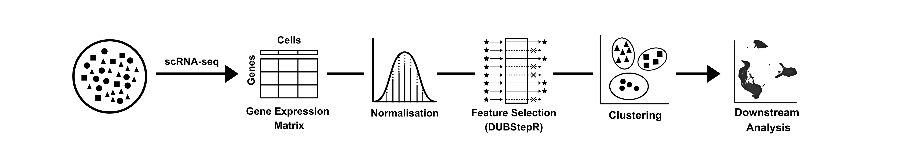
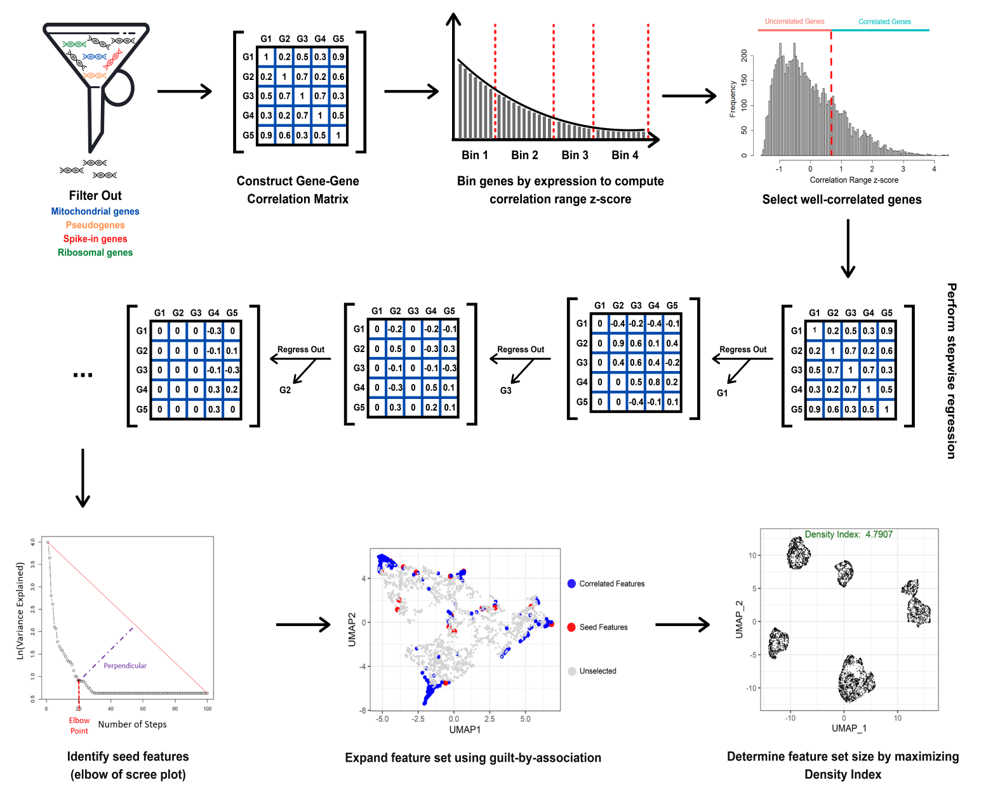

 

# DUBStepR

DUBStepR (Determining the Underlying Basis using Step-wise Regression) is a feature selection algorithm for cell type identification in single-cell RNA-sequencing data.

{ width=50% }

Feature selection, i.e. determining the optimal subset of genes to cluster cells into cell types, is a critical step in the unsupervised clustering of scRNA-seq data.

DUBStepR is based on the intuition that cell-type-specific marker genes tend to be well correlated with each other, i.e. they typically have strong positive and negative correlations with other marker genes. After filtering genes based on a correlation range score, DUBStepR exploits structure in the gene-gene correlation matrix to prioritize genes as features for clustering. A vignette for using DUBStepR on scRNA-seq data can be accessed using `browseVignettes("DUBStepR")`.

The DUBStepR methodology is described in the workflow below, and in our [latest preprint on bioRxiv](https://doi.org/10.1101/2020.10.07.330563):

{ width=50% }